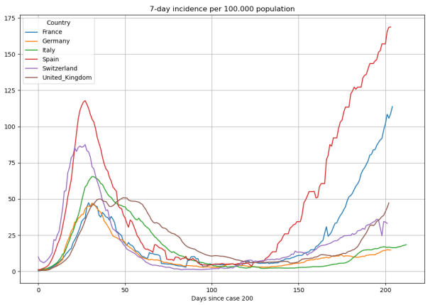
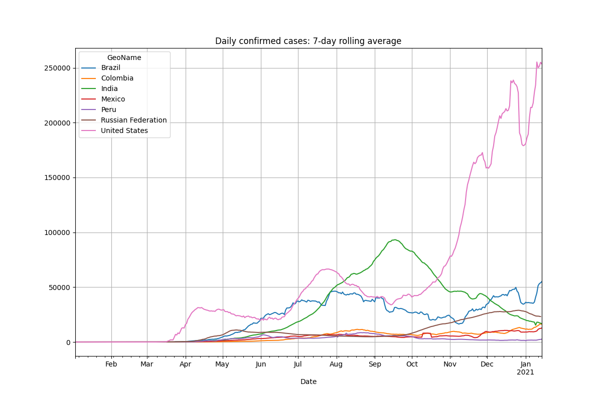
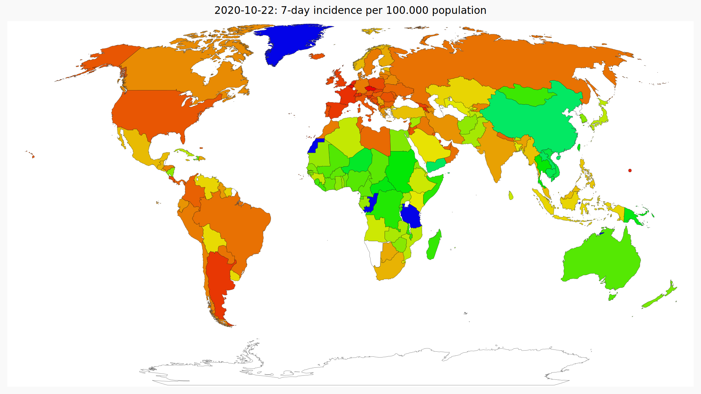
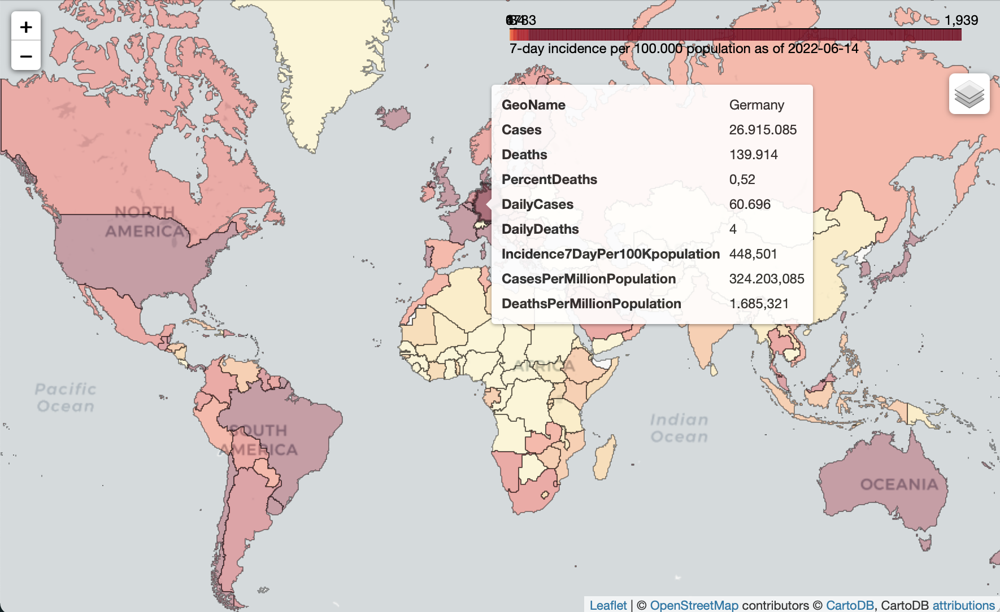
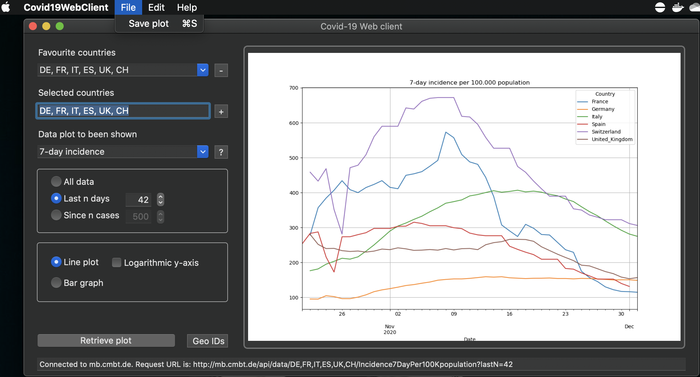
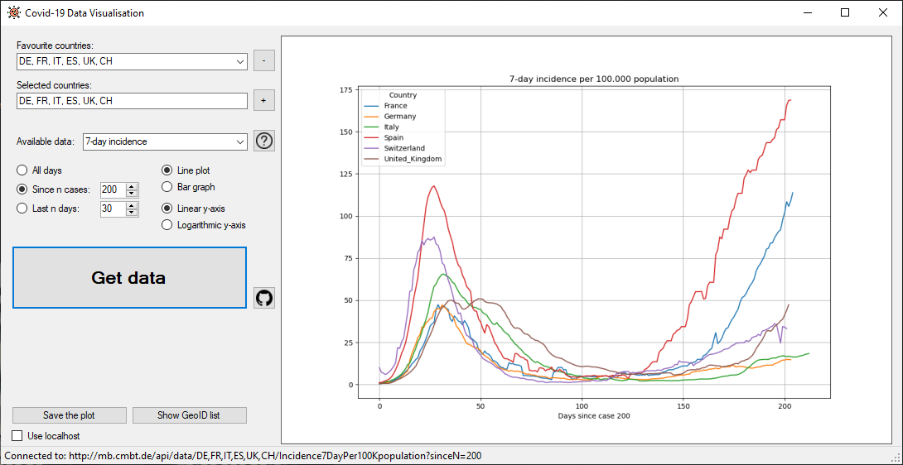

# Covid-19-analysis
<br>
<br>
<br><br> 

## Introduction
We supply source code to get and process the data about Covid-19 infections around the world over the time. The documentation of the source code be found here:  
<a href="http://mb.cmbt.de/python-class-documentation/" target="blank">http://mb.cmbt.de/</a>.  
Beside some Jupyter Notebooks, a REST API and Windows and MacOS applications to access it, you will find python classes to automatically download the data from the following organizations:

1. World Health Organization (WHO)

> The WHO publishes the data on a dashboard available on the <a href="https://covid19.who.int/table" target="blank">WHO Covid-19 pages</a>.   

2. European Centre for Disease Prevention and Control (ECDC)

> Since 14.12.2020 the <a href="https://www.ecdc.europa.eu/en/publications-data/download-todays-data-geographic-distribution-covid-19-cases-worldwide" target="blank">ECDC</a> publishes only weekly numbers.  

3. Our World in Data (OWID)

> According to the <a href="https://github.com/owid/covid-19-data/tree/master/public/data" target="blank">OWID website</a> the Covid-19 data provided is coming from the *COVID-19 Data Repository by the Center for Systems Science  
and Engineering (CSSE) at Johns Hopkins University* (<a href="https://github.com/CSSEGISandData/COVID-19" target="blank">JHU</a>).  

Based on that raw data we provide functions to calculate the following attributes:  
<br>

| Column | Description |
| --- | --- |
| **GeoName** | The name of the country, county or city  
| **GeoID** | The GeoID of the country. Refer [to this post](/covid-19-analysis/list-of-geoids-and-countries/) to get a list of GeoIDs and country names.  
| **Population** | The population of the country, county or city based on 2019 data.  
| **Continent** | The continent of the country. In case of a city it may be the county. In case of a county it may be a federal state or region. In general it's a grouping in a level above the meaning of the GeoName -  GeoID combination.  
| **DailyCases** | The daily number of confirmed cases.  
| **DailyDeaths** | The daily number of deaths of confirmed cases  
| **Cases** | The overall number of confirmed infections (here called *cases*) since December 31st. 2019 as published by the data source.  
| **Deaths** | The overall number of deaths of confirmed cases.  
| **PercentDeaths** | The percentage of deaths of the confirmed cases. This is also called <a href="https://en.wikipedia.org/wiki/Case_fatality_rate" target="blank">Case-Fatality-Rate (CFR)</a> which is an estimation for the <a href="https://en.wikipedia.org/wiki/Case_fatality_rate#Infection_fatality_rate" target="blank">Infection-Fatality-Rate (IFR)</a> which also includes unconfirmed (*hidden* or *dark*) infections  
| **DoublingTime** | The time in days after which the number of Cases are doubled  
| **CasesPerMillionPopulation** | The number of **Cases** divided by the population in million  
| **DeathsPerMillionPopulation** | The number of **Deaths** divided by the population in million  

If you use the data from **Our World in Data** you have additional access to the following attributes:  
<br>

| Column | Description |
| --- | --- |
| **DailyVaccineDosesAdministered7DayAverage** | New COVID-19 vaccination doses administered (7-day smoothed). For countries that don't report vaccination data on a daily basis, we assume that vaccination changed equally on a daily basis over any periods in which no data was reported. This produces a complete series of daily figures, which is then averaged over a rolling 7-day window. In OWID words this is the new_vaccinations_smoothed value.  
| **VaccineDosesAdministered** | Total number of COVID-19 vaccination doses administered. It's the sum of *PeopleReceivedFirstDose* and *PeopleReceivedAllDoses*. In OWID words this is the total_vaccinations value.  
| **PeopleReceivedFirstDose** | Total number of people who received at least one vaccine dose. In OWID words this is the people_vaccinated value.  
| **PercentPeopleReceivedFirstDose** | The percentage of people of the population who received at least one vaccine dose.  
| **PeopleReceivedAllDoses** | Total number of people who received all doses defined by the vaccination protocol. In OWID words this is the people_fully_vaccinated value.  
| **PercentPeopleReceivedAllDoses** | The percentage of people of the population who received all doses defined by the vaccination protocol.  

Other functions will allow you to calculate the following additional attributes:  
<br>

| Column | Description |
| --- | --- |
| **R** | An estimation of the reproduction number R0. The attribute should finally be low-pass filtered with a kernel size of 7.  
| **Incidence7DayPer100Kpopulation** | The accumulated 7-day incidence. That is the sum of the daily cases of the last 7 days divided by the population in 100000 people.  
| **DailyCases7** | After calling ```add_lowpass_filter_for_attribute``` with the attribute name **DailyCases** and a filter size of **7** you will get this new attribute that represents the average number of **DailyCases** of the last 7 days. Of course you can filter **all of the attributes** given in the lists above with whatever filter size.  


Once having the data calculated we generate plots using the *matplot* library such as these:  




You can also generate heatmaps using *pygal* such as this:



The latest version as of 2022.01.21 also added functions to generate Folium Choropleth maps with the help of geoPandas. The maps are generated as HTML files and offer some interactions like getting tooltips to show the data of a region. This is an example of such a map:



All of that graphics can be published using a REST API for which you will find the sources here as well. For your convenience in getting a quick look to the data we offer the REST API on a private server that you can access here: <a href="http://mb.cmbt.de/docs" target="blank">http://mb.cmbt.de/docs</a>  

For the quick look we also offer a Windows Forms CSharp application and a MacOS Swift application. You will find the source code for them here as well and you can download the <a href="http://mb.cmbt.de/download-area" target="blank">installer here</a>. Here are some screenshots of the applications:  




